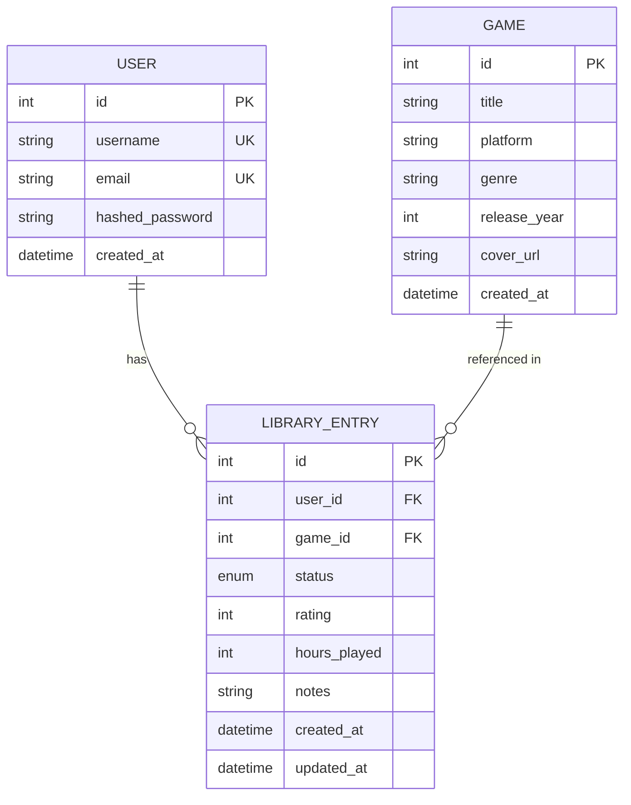

# Модель данных

## ER-диаграмма

## Сущность User — пользователь сервиса

Описывает зарегистрированного пользователя. Каждый пользователь владеет собственной библиотекой.

| Поле | Тип | Ограничения | Описание |
|------|-----|-------------|----------|
| id | int | PK, auto-increment | Уникальный идентификатор. Генерируется БД. |
| username | str(50) | unique, not null, index | Логин. Используется для входа. |
| email | str(255) | unique, not null, index | Email. Тоже уникален. |
| hashed_password | str(255) | not null | bcrypt-хеш пароля. Никогда не храним пароль в открытом виде. |
| created_at | datetime | not null, default=now (UTC) | Дата регистрации. |

**Правила:**
- `username`: 3–50 символов, только `a-z A-Z 0-9 _ -`.
- `email`: валидный email (проверяется Pydantic).
- Пароль (до хеширования): минимум 8 символов, хотя бы одна буква и одна цифра.

**Что НЕ храним:**
- Открытый пароль — никогда.
- Роль (admin/user) — пока не нужна, добавим, если появится админка.

## Сущность Game — игра (общий каталог)

Описывает игру как таковую, независимо от того, кто её добавил. Игры переиспользуются между пользователями.

| Поле | Тип | Ограничения | Описание |
|------|-----|-------------|----------|
| id | int | PK, auto-increment | Идентификатор игры. |
| title | str(255) | not null | Название игры. |
| platform | str(50) | not null | Платформа: PC, PS5, Xbox, Switch и т.п. |
| genre | str(50) | nullable | Жанр: RPG, Shooter, Strategy, ... |
| release_year | int | nullable, 1950..2100 | Год выхода. |
| cover_url | str(500) | nullable | Ссылка на обложку. |
| created_at | datetime | not null, default=now (UTC) | Когда игра добавлена в каталог. |

**Правила:**
- `platform` — фиксированный список (enum-подобный): `PC`, `PS5`, `Xbox`, `Switch`, `Mobile`, `Other`.
- `release_year` — валидируем диапазоном, потому что игры до 1950 года не существуют, а после 2100 — фантастика.
- Комбинация `(title, platform, release_year)` — фактически уникальна, но **не ставим unique constraint**, чтобы не блокировать случайные варианты (например, ремейки). Позже, если понадобится, добавим.

## Сущность LibraryEntry — запись в библиотеке

Связывает User и Game. Хранит статус прохождения, оценку, заметки.

| Поле | Тип | Ограничения | Описание |
|------|-----|-------------|----------|
| id | int | PK, auto-increment | Идентификатор записи. |
| user_id | int | FK → user.id, not null, on delete CASCADE | Владелец записи. |
| game_id | int | FK → game.id, not null, on delete CASCADE | Игра. |
| status | enum | not null, default='planned' | planned / playing / completed / dropped |
| rating | int | nullable, 1..10 | Оценка от 1 до 10. |
| hours_played | int | nullable, >= 0 | Наиграно часов. |
| notes | str(1000) | nullable | Свободные заметки пользователя. |
| created_at | datetime | not null, default=now (UTC) | Когда добавлено. |
| updated_at | datetime | not null, on update now (UTC) | Когда последний раз менялось. |

**Ограничения:**
- Уникальная пара `(user_id, game_id)` — один пользователь не может иметь две записи по одной игре.
- `rating` заполняется только если `status` = `completed` или `dropped` (бизнес-правило, реализуется в сервисном слое).
- `hours_played` может расти даже в статусе `completed` (переигрывает).

